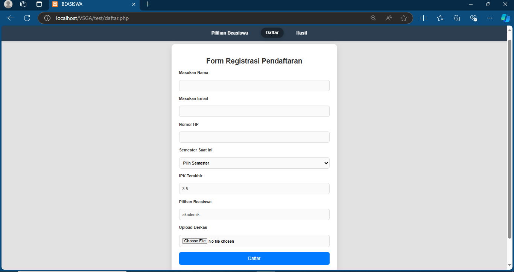

# Sistem Pendaftaran Beasiswa

Sistem ini adalah aplikasi berbasis web yang memungkinkan pengguna untuk melakukan pendaftaran beasiswa dengan memasukkan informasi seperti nama, email, nomor HP, semester, IPK, pilihan beasiswa, dan berkas dokumen pendukung.


## Fitur

- Pendaftaran beasiswa melalui form
- Upload berkas dokumen (gambar)
- Validasi input (nama, email, nomor HP, dll.)
- Penyimpanan data pendaftaran ke database MySQL


## Persyaratan Sistem

- PHP >= 7.0
- MySQL
- Web Server (Apache)
## Cara Instalasi

1. Clone repositori ini atau unduh file ZIP-nya:

```bash
git clone https://github.com/AgrisnaFathurrohman/Sistem-Pendaftaran-Beasiswa.git
```
2. Pindahkan ke direktori proyek:

```bash
cd repo-name
```
3. Buat database MySQL dan import file database.sql yang berisi struktur tabel:

```sql
CREATE DATABASE beasiswa_db;
USE beasiswa_db;

-- Import file database.sql ke database --
```
4. Atur koneksi database di file koneksi.php:

```php
$conn = new mysqli('localhost', 'username', 'password', 'beasiswa_db');
```

5. Jalankan proyek di localhost menggunakan server lokal seperti XAMPP

6. Akses aplikasi melalui browser di alamat:

```browser
http://localhost/nama-folder-proyek/pilihbeasiswa.php
```
## Struktur Direktori

- Assets/
    - CSS/
        - plhbeasiswa.css --> Styling halaman form beasiswa
        - dftar.css --> Styling halaman form pendaftaran
        - hsl.css --> Styling halaman hasil
    - JS/
        - script.js --> File JavaScript untuk interaksi halaman
    - uploads/ --> Folder untuk menyimpan file berkas yang diupload
- pilihbeasiswa.php --> Form untuk memilih beasiswa dan IPK
- daftar.php --> Form pendaftaran
- hasil.php --> Halaman untuk menampilkan hasil pendaftaran
- koneksi.php --> File koneksi database

## Penggunaan

1. Pilih beasiswa melalui halaman pilihbeasiswa.php.
2. Masukkan informasi pada form pendaftaran di halaman daftar.php.
3. Upload berkas dokumen yang diminta.
4. Klik tombol "Daftar" untuk menyimpan data ke database.
5. Lihat hasil pendaftaran di halaman hasil.php.

## Screenshots

1. Tampilan Form Beasiswa


2. Tampilan Form Pendaftaran



3. Tampilan Hasil


